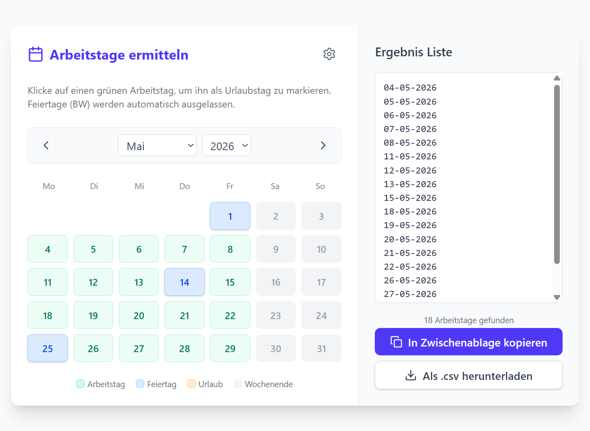

# Synergy Timer Tracker

Tool zum automatisierten Zeit-Tracking im [Exact-Synergy](https://www.exact.com/de/software/exact-synergy)-Mitarbeiterportal.

## Funktionsweise

Das Tool verbindet sich mit einer laufenden Chrome-Instanz im Debug-Modus,
liest Arbeitstage aus einer CSV-Datei und trägt für jeden Tag automatisch eine 
Arbeitszeit im Exact-Portal ein (Standard: 9:15–18:00 Uhr).  
Die CSV lässt sich hier generieren: 👉**https://zeiterfassung.tobse.eu**

## Voraussetzungen

- JDK 22
- Google Chrome
- Passender [ChromeDriver](https://googlechromelabs.github.io/chrome-for-testing/) (wird von Selenium 4 automatisch verwaltet)

## Einrichtung

### 1. Im Exact-Portal einloggen

Chrome einmalig mit aktiviertem Remote-Debugging starten und sich einloggen:

```
"C:\Program Files\Google\Chrome\Application\chrome.exe" --remote-debugging-port=9222 --user-data-dir="C:\temp\timer-tracker-chrome-profile\"
```
| Den Ordner `--user-data-dir` auf einen beliebigen Speicherort für ds Chrome-Profil setzen.

Portal-URL: https://employees.exact.com/docs/Home.aspx?id=43730

### 2. Arbeitstage pflegen

Die CSV-Datei lässt sich komfortabel über das Webtool generieren:  
👉**https://zeiterfassung.tobse.eu**



Die erzeugte Datei als `arbeitstage.csv` im Projektverzeichnis ablegen oder in die Zwischenablage kopieren.
Sie enthält die zu buchenden Arbeitstage, einen pro Zeile im Format `DD-MM-YYYY`:

```
01-04-2026
02-04-2026
09-04-2026
```

### 3. Tool ausführen

Chrome muss noch geöffnet und eingeloggt sein. Dann:

```bash
./gradlew run
```

Das Tool öffnet für jeden Eintrag in der CSV das Formular unter `employees.exact.com`, 
setzt Start- und Endzeit sowie das Datum und speichert den Datensatz.

## Konfiguration

Die gebuchten Zeiten sind direkt in [TimeTracker.kt](src/main/kotlin/de/tfr/tool/timetrack/TimeTracker.kt) hinterlegt:

| Parameter | Wert  |
|-----------|-------|
| Start     | 9:15  |
| Ende      | 18:00 |


## Abhängigkeiten

- [Selenium Java 4](https://www.selenium.dev/) – Browser-Automatisierung
- Kotlin 2.x / JVM 22